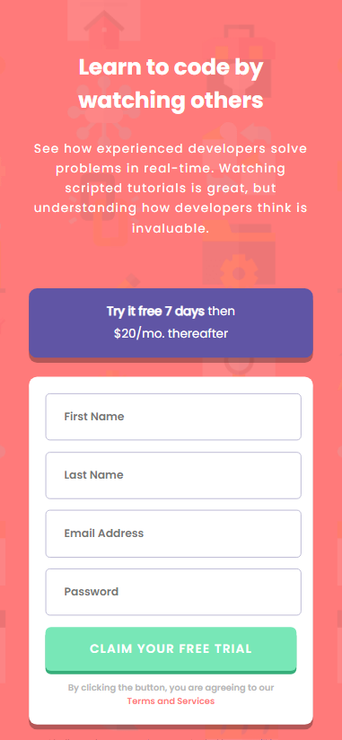

# Frontend Mentor - Intro component with sign up form solution

This is a solution to the [Intro component with sign up form challenge on Frontend Mentor](https://www.frontendmentor.io/challenges/intro-component-with-signup-form-5cf91bd49edda32581d28fd1). Frontend Mentor challenges help you improve your coding skills by building realistic projects. 

## Table of contents

- [Overview](#overview)
  - [The challenge](#the-challenge)
  - [Screenshot](#screenshot)
  - [Links](#links)
- [My process](#my-process)
  - [Built with](#built-with)
  - [What I learned](#what-i-learned)
  - [Continued development](#continued-development)
  - [Useful resources](#useful-resources)
- [Author](#author)

## Overview

### The challenge

Users should be able to:

- View the optimal layout for the site depending on their device's screen size
- See hover states for all interactive elements on the page
- Receive an error message when the `form` is submitted if:
  - Any `input` field is empty. The message for this error should say *"[Field Name] cannot be empty"*
  - The email address is not formatted correctly (i.e. a correct email address should have this structure: `name@host.tld`). The message for this error should say *"Looks like this is not an email"*

### Screenshot

Desktop:


Mobile: 



### Links

- [Live Site URL](https://signup-form-ianwilk20.netlify.app/design/index.html)

## My process

### Built with

- Semantic HTML5 markup
- CSS custom properties
- Flexbox
- Mobile-first workflow

### What I learned

- I learned that a mobile-first workflow is effective at speeding up the process of making a website responsive. I am contrasting this challenge with my prior Frontend Mentor challenge, which took about 2-3 times as long because of difficulties I had making the desktop layout responsive then making the mobile one responsive too.

- Form validation was cumbersome and, although I did not implement the best form validation, I learned some easy ways to validate minimal forms like this. A simple way to do form validation on click of a button is to hook up an event listener to a form:
```js
signUpForm.addEventListener("submit", (e) => {
    e.preventDefault();
    // Handle form validation in here
}
```
Then for each field in the form, again ideally forms with only very few fields, you should get the input by id and check if it's valid based on your validation requirements. If it's not valid show style the inputs so they appear to be invalid and show an error message:
```js
let firstName = document.getElementById('form-first-name')
let errorFirstName = document.getElementById('error-first-name')
if(firstName.value.trim() == "") { //If input is blank
  firstName.classList.add('invalid') //Add the invalid class to color the text, input border, and error icon
  errorFirstName.classList.add('show') //Show hidden error text for that input 
} else {
  firstName.classList.remove('invalid') //Remove the invalid class to color the text and input border
  errorFirstName.classList.remove('show') //Show hidden error text for that input 
}
```

```css
.invalid {
    margin-bottom: 0;
    border: hsl(0, 100%, 74%) 1px solid;
    color: hsl(0, 100%, 74%);
    background-image: url("../assets/images/icon-error.svg");
    background-repeat: no-repeat;
    background-position: 96% 50%;
}

.show {
    display: block;
    color: hsl(0, 100%, 74%);
    display: flex;
    justify-content: flex-end;
    font-size: .85rem;
    margin-top: 0.4rem;
    font-family: "Poppins Italic";
    margin-bottom: 1rem;
}
```

It should be noted that, in my experience, ideally forms are validated as users type in the fields, but that was not what was asked for in this beginner challenge.

### Continued development

I look forward to exploring the different form validation options since this approach was quite cumbersome. I have heard good things about React Hook Form and Zod.


### Useful resources

- [Client-side form validation - MDN Web Docs](https://developer.mozilla.org/en-US/docs/Learn/Forms/Form_validation) - This helped me when setting up the form validation for this challenge by explaining form validation concepts and the built-in contrain validation API.
- [Testing text for regex matches](https://stackoverflow.com/a/8663843) - I was having trouble using the match() function when testing the email's validity. It kept on returning null whether I provided a valid or invalid email. The linked answer provided a different approach using the built-in RegExp module.
## Author

- GitHub - [ianwilk20](https://github.com/ianwilk20)


